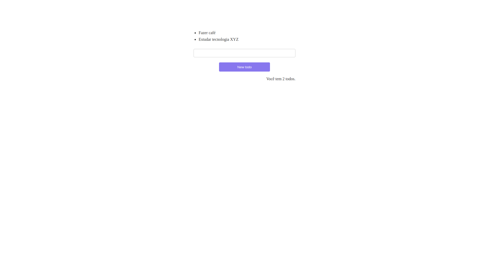

## Criado como teste:

- Uma action de criação de todos.

- Um reducer que ouve este action de criação de todos e altera o estado. 

- Um componente **TodoList** que depende deste estado, quando o mesmo é alterado, ocorre uma nova renderização.

- Um componente **Counter** que não realiza nenhuma alteração no estado, mas ouve suas mudanças e é re-renderizado.

**Qualquer outro componente que estiver ouvindo este estado, também sente as mudanças e renderiza novamente, qualquer componente pode além de ouvir, alterar o estado**

## Tecnologias:

- React

- Redux

- React-redux
